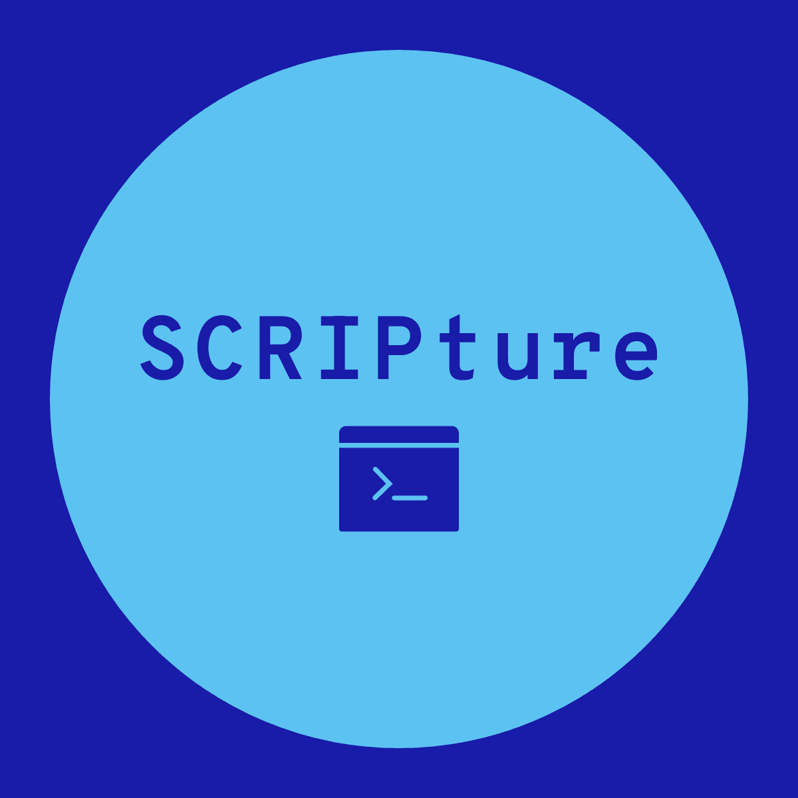
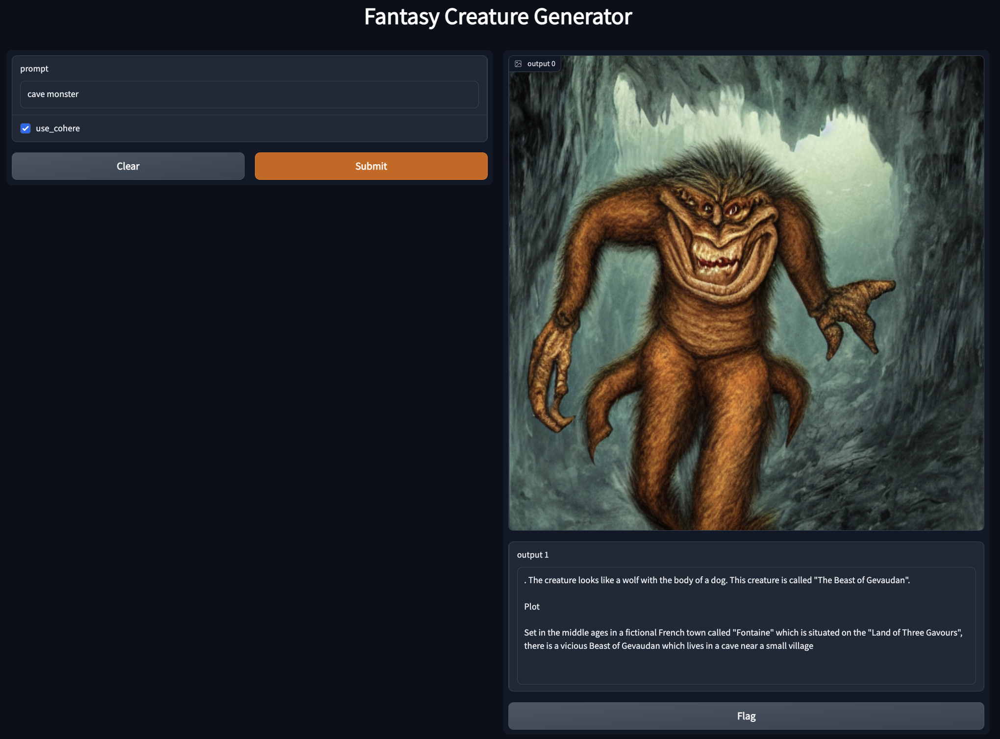

# SCRIPTure
Our Project for CalHacks 9.0: A tool for fantasy writers that generates images and background for monsters. Using a fine-tuned model on the Cohere API, Stable Diffusion, and Salesforce BLIP.


# Setup
**Must have python 3.9.0 or greater to run**

Run following terminal command inside of directory after cloning:
```
pip install -r SCRIPture/requirements.txt
```

# Running

Run the following terminal command to run the code in a local host: 
```
python SCRIPture/main.py
```
Copy and past local host into browser and press the generate button. 

# Example


